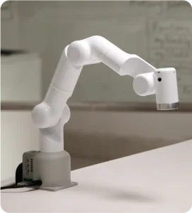

## 1.1 Design Concept

The Mercury A1 is a lightweight seven degree of freedom robotic arm with an effective load of 1 kilogram. It is equipped with 7 self-developed "Power Source" series harmonic modules for elephant robots. The maximum output torque can reach 80Nm, the encoder resolution is 19 bits, and the repetitive positioning accuracy is as high as 0.6 arc minutes. The new seven axis industrial design is carefully operated by a Swedish team, and the whole machine uses an ultra lightweight carbon fiber shell, which greatly improves the strength and rigidity of the whole machine while reducing weight. The main control CM4Stack is equipped with a 2.0-inch IPS-LCD capacitive touch screen and integrates the elephant's self-developed myPanel. It can intuitively deploy applications without programming and is an ideal hardware platform for teaching, research, and embodied intelligence research.

