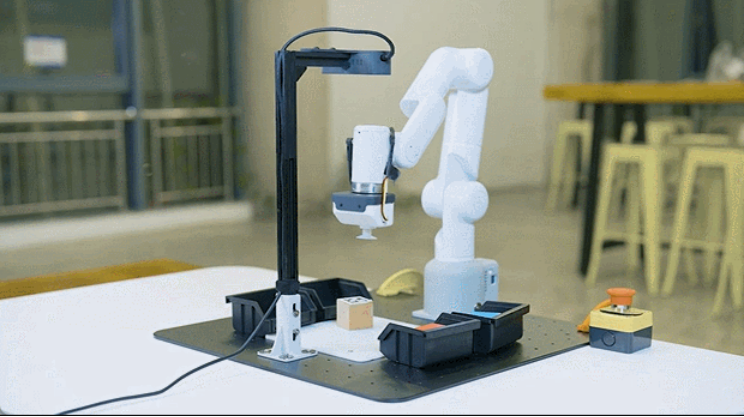

# 1.2 Application Scenarios

## 1.2.1 Research Scenarios

 The ideal hardware platform for teaching, research, and embodied intelligence research - Mercury A1

 
Thanks to the application of self-developed control algorithms and modules, A1 is the preferred model for research and application in multiple directions such as robotic arm motion planning and humanoid single arm applications.

##1.2.2 Educational Scenarios

The robot education teaching set can be paired with 2D or 3D vision modules to achieve knowledge learning in multiple disciplines and fields such as image recognition, model training, robot control, motion planning, robot space calibration, vision and robot hand eye calibration in humanoid embodied intelligent education.

## 1.2.3 Service Scenarios

The powerful performance and internal performance of the Mercury series, combined with an elegant exterior design, make Mercury robots not only suitable for educational and scientific research scenarios, but also for commercial service scenarios. With different end accessories and various daily furniture and appliances, robots can serve practical application environments such as company exhibitions, commercial exhibitions, and industry exchanges, showcasing the cool application of robot servers.

## 1.2.4 Entertainment Scenarios

Paired with custom end effectors, Mercury robots can simulate human actions for creative development of personal applications.

## 1.2.5 VR/Aloha Remote Operation Scenarios

Equipped with VR/Aloha and other devices to achieve remote control of robot applications
