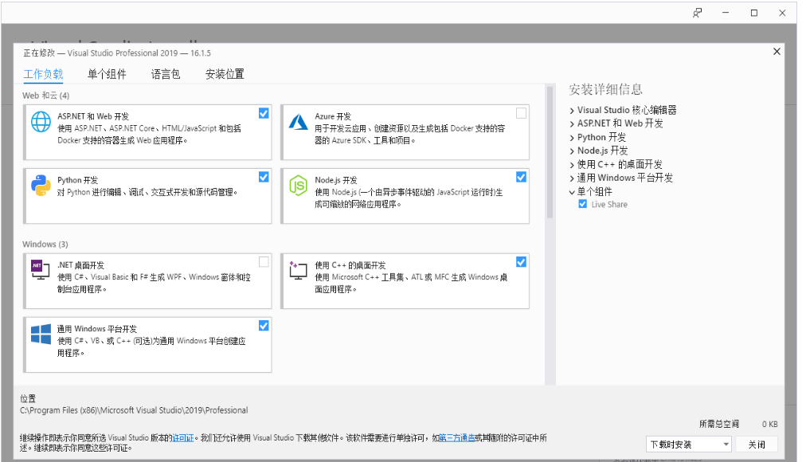

# C++

<<<<<<< HEAD
**使用c++语言，您可以通过我们公司开发的c++动态库，进行自由开发（坐标控制、角度控制、io控制、夹爪控制等），控制我们公司已经研发出来的部分机器人。** 

## C++是什么？

C++是C语言的继承，它既可以进行C语言的过程化程序设计，又可以进行以抽象数据类型为特点的基于对象的程序设计，还可以进行以继承和多态为特点的面向对象的程序设计。 
C++擅长面向对象程序设计的同时，还可以进行基于过程的程序设计，因而C++就适应的问题规模而论，大小由之。 
C++不仅拥有计算机高效运行的实用性特征，同时还致力于提高大规模程序的编程质量与程序设计语言的问题描述能力。

## 编程开发

### 部分集成开发环境（IDE)
=======
** Using c++ language, you can freely develop (coordinate control, Angle control, io control, claw control, etc.) through the c++ dynamic library developed by our company to control some of the robots that our company has developed. ** 

## What is C++?

C++ is the inheritance of C language, it can not only carry out procedural programming of C language, but also carry out object-based programming characterized by abstract data types, but also carry out object-oriented programming characterized by inheritance and polymorphism.  
While C++ is good at object-oriented programming, it can also do process-based programming, so the size of C++ in terms of the size of the problem it ADAPTS to depends on it.  
C++ not only has the practical characteristics of efficient operation of computers, but also aims to improve the programming quality of large-scale programs and the problem description ability of programming language.

## Programming development

### Partial Integrated Development Environment (IDE)
>>>>>>> b4cbb522d469c9fae1bce398ab2eea533b152ea9

**Visual Studio (Visual C++)** 
**Dev C++** 
**C++ Builder**

<<<<<<< HEAD
### 编译器
=======
### compiler
>>>>>>> b4cbb522d469c9fae1bce398ab2eea533b152ea9

**Ultimate++** 
**Digital Mars** 
**C-Free** 
**MinGW**

<<<<<<< HEAD

# C++ 环境搭建

## 1 确认开发目标

**Mercurycpp是一个和Mercury进行串口通讯的接口程序，调用的是我们公司自己开发的Mercury库，里面有简单的使用案例。如果您想通过**c++**进行自由开发，控制我们公司已经研发出来的机器人，那么它是您的选择。** 
支持的机械臂型号：**MercurycppA1** 
**运行Mercurycpp所需要的软件：vs2019、qt5.12.10、vsaddin（qt插件）。** 

## 2 Windows环境配置

###2.1 安装vs2019

- 下载： 
首先在官网下载[vs2019](https://visualstudio.microsoft.com/zh-hans/vs/)。  

- 安装： 
安装完成后，会出现下图所示界面，主要选择“通用Windows平台开发、使用C++的桌面开发、ASRNET和Web开发”这3个（此处只是建议，具体可根据自己的需求选择，vs2019安装时间较长）。 
 

- 环境变量配置： 
此电脑--》右键 属性--》高级系统设置--》环境变量--》看系统变量处，点击新建--》变量名：VCINSTALLDIR 变量值：找到Redist所在目录(如：D:\vs2019\VC），具体如下图所示： 

### 2.2 安装qt5.12.10

- 下载： 
下载[qt5.12.10](https://download.qt.io/archive/qt/)及以上版本都可以，具体操作如下图： 
 

- 安装： 
首先登录qt账号，没有就先注册。接下来会出现选择组件的界面，windows上选择MinGW和MSVC即可，具体如下图所示： 
 

- 环境变量配置： 
	此电脑--》右键 属性--》高级系统设置--》环境变量--》看系统变量处，点击新建--》变量名：QTDIR 变量值：msvc2017_64所在目录（如：D:\qt5.12.10\5.12.10\msvc2017_64，具体看自己电脑的安装路径），具体如下图所示： 
	 
	
### 2.3 安装qt插件vsaddin

- 下载： 
首先选择对应vs2019的[vsaddin](https://download.qt.io/archive/vsaddin/)版本,具体操作如下图： 
 

- 安装：直接安装即可 
- 配置： 
	vs2019菜单栏 扩展--》QT VS ToolS--》QT Versions--》add new qtversion Path选择msvc2017_64所在路径（如：D:\qt5.12.10\5.12.10\msvc2017_64），具体操作如下图所示： 
	 
	
	
## 3 Linux环境配置

### 3.1 安装qt5.12.10

- 下载： 
下载地址和Windows一样，选择linux上的安装包即可，具体可看上面的8.1.2.2。 

- 安装： 
命令行安装：运行./“安装包名称”，如果没有执行权限，加执行权限：sudo chmod +x “安装包名称”，然后进入图形界面，和Windows一样； 
图形界面安装：和Windows一样。 
建议直接普通用户权限安装qt，安装成功后可以执行qmake --version，出现如下界面安装成功： 
 

- 配置： 
打开配置文件，普通用户安装qt：vi ~/.bashrc，root用户安装qt：vi ~/.profile。在配置文件中添加：export QTDIR=“qt所在目录”（如：export QTDIR=$HOME/Qt/5.12.10/gcc_64），具体如下图所示： 
=======
# C++ environment setup

## 1 Identify development goals

**MercuryCpp is an interface program for serial communication with Mercury, which calls the Mercury library developed by our company, which has a simple use case. If you want to freely develop through **c++** and control the robots that our company has developed, then it is your choice.** 
Supported arm model: **mercury** 
**Software required to run MercuryCpp: vs2019, qt5.12.10, vsaddin (qt plugin).** 

## 2 Configure the Windows environment

### 2.1 Install vs2019

- Download:  
First download it on the official website[vs2019](https://visualstudio.microsoft.com/zh-hans/vs/)。  

- Installation:  
After the installation is complete, the interface shown in the following figure will appear, mainly select "universal Windows platform development, desktop development using C++, ASRNET and Web development" these three (here is only a suggestion, you can choose according to your needs, vs2019 takes a long time to install).  
 

- Environment variable configuration:  
This computer -- "right click properties --" Advanced system Settings -- "Environment variables --" look at the system variables, click New -- "variable name: VCINSTALLDIR Variable value: Find the directory where Redist is located (such as: D:\vs2019\VC), as shown below:  

### 2.2 Install qt5.12.10

- Download： 
Download[qt5.12.10](https://download.qt.io/archive/qt/)The above versions can be used. The specific operation is as follows:  
 

- Installation:  
First login to the qt account, do not register first. Next, the interface for selecting components will appear, MinGW and MSVC can be selected on windows, as shown below:  
 

- Environment variable configuration:  
This computer -- "Right click properties --" Advanced System Settings -- "Environment variables --" look at the system variables, click new -- "variable name: QTDIR Variable value: msvc2017_64 directory (such as: D:\qt5.12.10\5.12.10\msvc2017_64, see the installation path of your computer), as shown in the following figure:  
	 
	
### 2.3 Install the qt plugin vsaddin

- Download:  
First select the corresponding vs2019[vsaddin](https://download.qt.io/archive/vsaddin/)Version, the specific operation is as follows:  
 

- Installation: Directly install  
- Configuration:  
vs2019 menu bar extension -- QT VS ToolS-- QT Versions-- add new qtversion Path Select the path where msvc2017_64 resides (for example: D:\qt5.12.10\5.12.10\msvc2017_64), the specific operation is shown as follows:  
	 
	
	
## 3 Configure the Linux environment

### 3.1 Installing qt5.12.10

- Download:  
The download address is the same as for Windows, select the installation package on linux, see 8.1.2.2 above.  

- Installation:  
Command line installation: Run./ "Installation package name", if there is no execution permission, add the execution permission: sudo chmod +x "Installation package name", and then enter the graphical interface, the same as Windows;  
GUI installation: same as Windows.  
You are advised to install qt as a common user. After the installation is successful, run qmake --version. The following information is displayed:  
 

- Configuration:  
Open the configuration file, and install qt: vi ~/.bashrc as a common user and qt: vi ~/.profile as a root user. Add export QTDIR= "directory where qt is located" (for example, export QTDIR=$HOME/Qt/5.12.10/gcc_64) to the configuration file, as shown in the following figure:  
>>>>>>> b4cbb522d469c9fae1bce398ab2eea533b152ea9
 