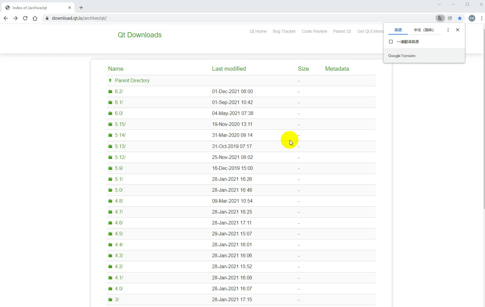
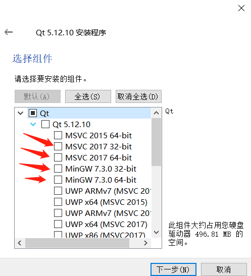
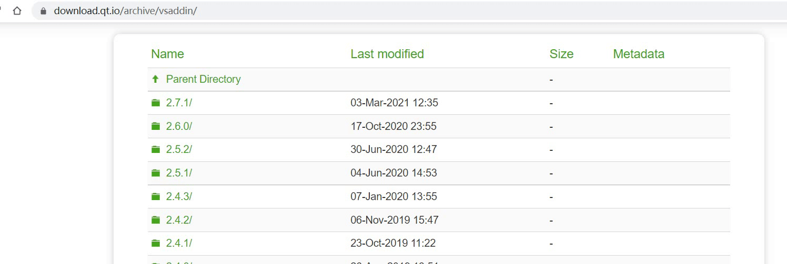
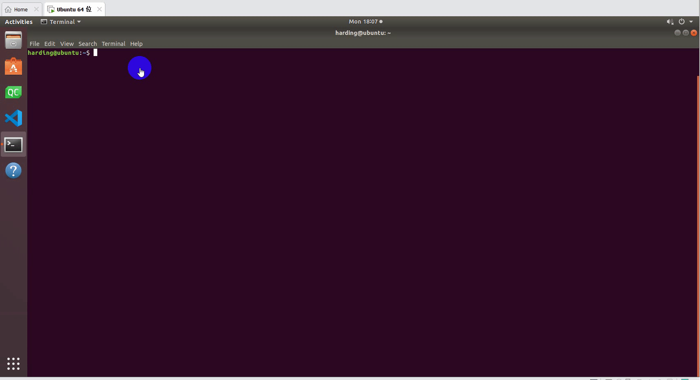
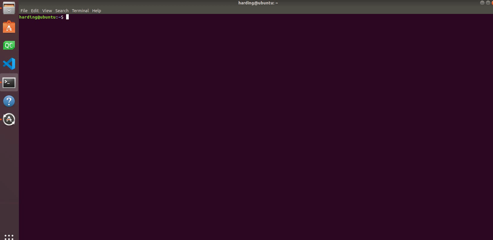

# C++ environment setup

## 1 Identify development goals

**MercuryCpp is an interface program for serial communication with Mercury, which calls the Mercury library developed by our company, which has a simple use case. If you want to freely develop through **c++** and control the robots that our company has developed, then it is your choice.** 
Supported arm model: **mercury** 
**Software required to run MercuryCpp: vs2019, qt5.12.10, vsaddin (qt plugin).** 

## 2 Configure the Windows environment

###2.1 Install vs2019

- Download:  
First download it on the official website[vs2019](https://visualstudio.microsoft.com/zh-hans/vs/)。  

- Installation:  
After the installation is complete, the interface shown in the following figure will appear, mainly select "universal Windows platform development, desktop development using C++, ASRNET and Web development" these three (here is only a suggestion, you can choose according to your needs, vs2019 takes a long time to install).  
 

- Environment variable configuration:  
This computer -- "right click properties --" Advanced system Settings -- "Environment variables --" look at the system variables, click New -- "variable name: VCINSTALLDIR Variable value: Find the directory where Redist is located (such as: D:\vs2019\VC), as shown below:  

### 2.2 Install qt5.12.10

- Download： 
Download[qt5.12.10](https://download.qt.io/archive/qt/)The above versions can be used. The specific operation is as follows:  
 

- Installation:  
First login to the qt account, do not register first. Next, the interface for selecting components will appear, MinGW and MSVC can be selected on windows, as shown below:  
 

- Environment variable configuration:  
This computer -- "Right click properties --" Advanced System Settings -- "Environment variables --" look at the system variables, click new -- "variable name: QTDIR Variable value: msvc2017_64 directory (such as: D:\qt5.12.10\5.12.10\msvc2017_64, see the installation path of your computer), as shown in the following figure:  
	 
	
### 2.3 Install the qt plugin vsaddin

- Download:  
First select the corresponding vs2019[vsaddin](https://download.qt.io/archive/vsaddin/)Version, the specific operation is as follows:  
 

- Installation: Directly install  
- Configuration:  
vs2019 menu bar extension -- QT VS ToolS-- QT Versions-- add new qtversion Path Select the path where msvc2017_64 resides (for example: D:\qt5.12.10\5.12.10\msvc2017_64), the specific operation is shown as follows:  
	 
	
	
## 3 Configure the Linux environment

3.1 Installing qt5.12.10

- Download:  
The download address is the same as for Windows, select the installation package on linux, see 8.1.2.2 above.  

- Installation:  
Command line installation: Run./ "Installation package name", if there is no execution permission, add the execution permission: sudo chmod +x "Installation package name", and then enter the graphical interface, the same as Windows;  
GUI installation: same as Windows.  
You are advised to install qt as a common user. After the installation is successful, run qmake --version. The following information is displayed:  
 

- Configuration:  
Open the configuration file, and install qt: vi ~/.bashrc as a common user and qt: vi ~/.profile as a root user. Add export QTDIR= "directory where qt is located" (for example, export QTDIR=$HOME/Qt/5.12.10/gcc_64) to the configuration file, as shown in the following figure:  
 