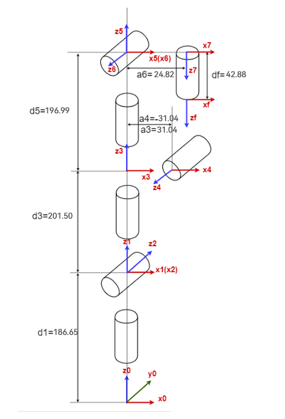

# Product specification parameter

## 1 Manipulator parameter

| Index                          | Parameter                                    |
|:------------------------------:|:--------------------------------------------:|
| Name                           | Elephant Consumer Robotic Arm                |
| Model                          | MercuryA1                                    |
| Product Size                   | 98*128*640mm                                 |
| Freedom                        | 7                                            |
| Working Radius                 | 450mm                                        |
| Efficient Load                 | 1kg                                          |
| Repeated Positioning Precision | ±0.05mm                                      |
| Weight                         | 3.5kg                                        |
| Power Input                    | DC24V/9.2A                                   |
| Housing Material               | Carbon Fiber                                 |
| Communication Interface        | WIFI/CAN bus/Bluetooth   /USB/Serial Port |
| Service life                   | 5000 hours                                   |

## 2 Structural Parameter

| joint | joint minimum value ° | joint maximum value ° | joint maximum speed (°/s) | joint maximum acceleration (°/s²) |
|------|--------|--------|----------------|-------------------|
| J1   | -175   | 175    | 150            | 200               |
| J2   | -65    | 115    | 150            | 200                |
| J3   | -175   | 175    | 150            | 200              |
| J4   | -180   | 10     | 150            | 200               |
| J5   | -175   | 175    | 150                | 200                  |
| J6   | -20    | 173    | 150                | 200                  |
| J7   | -180    | 180    | 150                | 200                  |

## 3 Software basic function Support

| Function/development environment | Usage situation |
|:--------------------------------:|:---------------:|
| Free Mobile                      | Support         |
| Articulated Movement             | Support         |
| Cartesian Movement               | Support         |
| Path Recording                   | Support         |
| Wireless Control                 | Support         |
| Emergency Stop                   | Support         |
| Windows                          | Support         |
| Linux                            | Support         |
| MAC                              | Support         |
| ROS 1                            | Support         |
| Python                           | Support         |
| C++                              | Support         |
| C#                               | Support         |
| JavaScript                       | Support         |
| myblockly                        | Support         |
| Arduino                          | Support         |
| mystudio                         | Support         |
| Serial Control Protocol          | Support         |
| TCP/IP                           | Support         |
| MODBUS                           | Support         |

 ---

[← Previous Page](../1-ProductIntroduction\README.md)| [Next Page →](../2-ProductFeature/2.2-ControlCoreParameter.md)