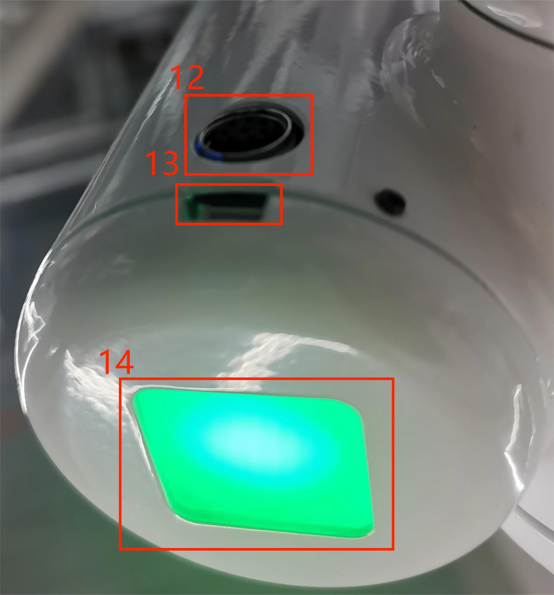

# 电气特性参数

## 1 底座接口总览

图1 底座左视图

图2 底座前视图

图3 底座右视图

## 1.1 底座接口说明
| 编号 | 接口    | 定义 | 功能         | 备注         |
|:----:|:--------------:|:---------:|:-----------------:|:----------------:|
| 1    | 开关         | 电源开关  | 控制输入电源通断  | 带灯（通电灯亮） | 
| 2    | 急停接口 | STOP      | 急停回路接口 |             |   
| 3    | USB3.2       | USB3.2*2   | 可外接设备或U盘   |                  |                    
| 5    | HDMI        |   |连接显示屏时使用   |       |
| 6    | 串口        |   |用于传输和接收串行数据的通信接口   |       |
| 7    | I2C接口       |   |用于连接I2C设备   |       |
| 8    | USB2.0       | USB2.0   | 可外接设备或U盘   |                |
| 10    | Type C         | 通讯接口 | 与PC机通讯 | 开发使用 |
| 11  | 电源输入接口 | DC24V输入 | DC24V 输入 |                  |

#### 1 电源开关：控制总电源输入的通断，关闭时，控制器也断电

#### 2 急停回路端子：与急停按钮盒连接，可用于控制机器人紧急停止
>  **注**: 机器人使用中必须接上急停开关，并确保急停开关回路处于连通状态。

#### 3 USB3.2接口：以串口总线标准3.0进行数据连接的接口；用户可以使用USB接口拷贝程序文件，也可以使用USB接口连接鼠标、键盘等外设

#### 5 HDMI显示接口 ：用户可以通过连接MicroHDMI显示接口，将操作页面显示到其他设备终端

#### 6 UART串口：用于传输和接收串行数据的通信接口

#### 7 I2C接口：用于连接I2C设备

#### 8 USB-C接口：以串口总线标准2.0进行数据连接的接口；用户可以使用USB接口拷贝程序文件，也可以使用USB接口连接鼠标、键盘等外设，带有OTG功能的 USB2.0接口，由MP8759和AW32901控制器供电

#### 9 Type C ：用于与PC端连接通讯，开发人员使用

#### 10 电源输入接口：本接口与DC24V电源适配器接口连接

## 1.2 底座IO接口说明
| 编号 | 接口    | 定义 | 功能         | 备注         |
|:----:|:--------------:|:---------:|:-----------------:|:----------------:|
| 1    | DC/IO接口 | GND       | GND               |                  |
|      |                | IN6       | 数字输入信号 1~6 | 输入只有NPN模式 |
|      |                | IN5       |                   |                  |
|      |                | IN4       |                   |                  |
|      |                | IN3       |                   |                  |
|      |                | IN2       |                   |                  |
|      |                | IN1       |                   |                  |
|      |                | 24V       | DC24V             |    DC24V输入              |
| 2   | DC/IO接口 | 24V       | DC24V             |   DC24V输出               |
|      |                | OUT1      | 数字输出信号1~6 | 输出只有PNP模式 |
|      |                | OUT2      |                   |                  |
|      |                | OUT3      |                   |                  |
|      |                | OUT4      |                   |                  |
|      |                | OUT5      |                   |                  |
|      |                | OUT6      |                   |                  |
|      |                | GND       | GND               |                  |

#### 1 数字输入/数字输出：

包括 6 个数字输入信号和 6 个数字输出信号，用于与其他设备进行交互，与其他设备共同构成自动化系统中的重要组成部分。

需要注意的是，输出信号为PNP形式，输入信号为NPN形式，以下为外部接线示意图：

## 2 末端接口总览

resources\2-ProductFeature\末端侧视图.jpg

机械臂末端侧视图

## 2.1 末端接口说明
| 编号 | 接口    | 定义 | 功能         | 备注         |
|:------:|:----------------:|:-----------:|:-------------------:|:------------------:|
| 12   | M8航空插座 | 末端工具IO接口 |  与外部设备交互 |                  |
| 13   | Atom       | Led + 按钮 | 状态查看/拖动示教 |                  |
| 14   |   4pinUSB端子   | 对外接口 | 连接摄像头 |  |
| 15   | Grove      |                |               烧录Atom固件    | 开发人员使用 |

#### 1 如图所示是M8航空插座I/O图，MercuryA1机器人提供了一路输入和两路输出。

各个工具I/O端口的定义如下表所示，注意的是，工具I/O无论是输入还是输出都是PNP类型，接线方式同底部输出接口一致。

| 编号 | 信号 | 解释             | 配套M8线颜色 |
| :------: | :------: | :-----------------------: | :--------------------------: |
| 1      | GND    | DC24V 负极      | 白                      |
| 2      | OUT1   | 工具输出接口1 | 褐                      |
| 3      | OUT2   | 工具输出接口2 | 绿                      |
| 4      | 485A   | 预留, 未开发   | 黄                     |
| 5      | 24V    | DC24V 正极         | 灰                        |
| 6      | IN1    | 工具输入接口1  | 粉                       |
| 7      | IN2    | 具输入接口2             | 蓝                      |
| 8      | 485B   | 预留, 未开发   | 紫                    |

#### 2.1.2 Atom：Atom用于5X5 RGB LED，显示机械臂状态和按键功能(机器人进行拖拽教学时使用)

---

[← 上一页](../2-ProductFeature/2.3-MechanicalStructureParameter.md)| [下一页 →](../2-ProductFeature/2..5-CoordinateSystem.md)