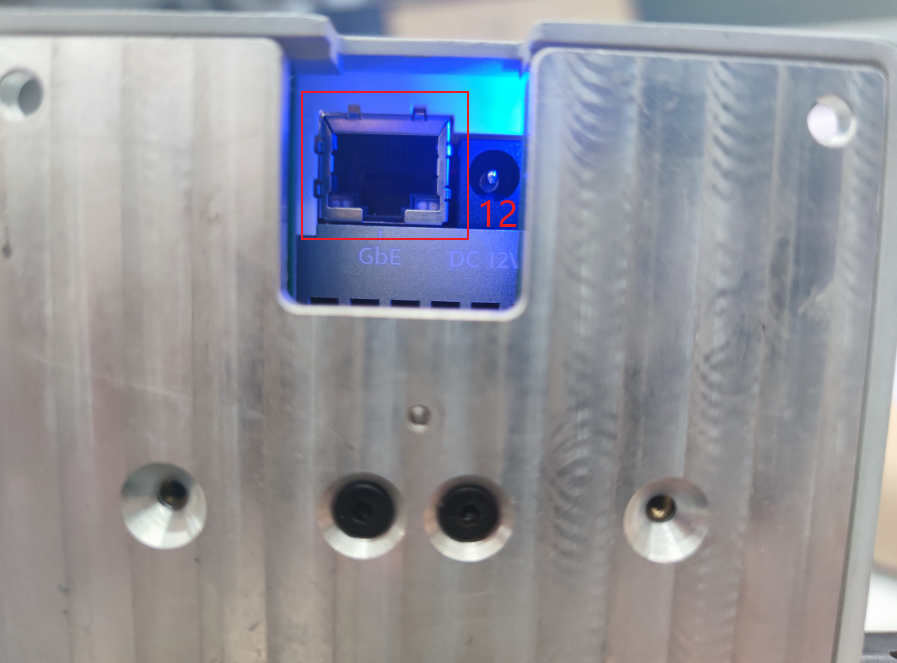

# Electrical characteristic parameter

## 1 Base Interface Overview

Figure 1 Left side of the base

Figure 2 Front view of a base

Figure 3 Right side of the base

Figure 4 Bottom side of the base

## 1.1 Base Interface Description
| No. | Interface | Definition | Function | Remarks |
|:----:|:--------------:|:---------:|:-----------------:|:----------------:|
| 1    | Switch         | Power Switch  | Controls the power input on/off  | With light (lights up when powered) | 
| 2    | Emergency Stop Interface | STOP      | Emergency stop circuit interface |             |   
| 3    | USB3.2       | USB3.2*2   | Can connect external devices or USB drives   |                  |                    
| 5    | HDMI        |   | Used for connecting display screens   |       |
| 6    | Serial Port        |   | Used for transmitting and receiving serial data   |       |
| 7    | I2C Interface       |   | Used for connecting I2C devices   |       |
| 8    | USB2.0       | USB2.0   | Can connect external devices or USB drives   |                |
| 10    | Type C         | Communication Interface | Communicates with PC | For development use |
| 11  | Power Input Interface | DC24V Input | DC24V Input |                  |
| 12  | Network Port |  | Used for network access |                  |

#### 1 Power Switch: Controls the on/off of the main power input. When turned off, the controller is also powered off.

#### 2 Emergency Stop Terminal: Connected to the emergency stop button box, used to control the robot's emergency stop.
>  **Note**:The emergency stop switch must be connected during robot operation, and ensure that the emergency stop switch circuit is in a connected state.

#### 3 USB3.2 Interface: Interface for data connection using the USB 3.0 serial bus standard. Users can use the USB interface to copy program files or connect peripherals such as mice and keyboards.

#### 5 HDMI Display Interface: Users can display the operating interface on other devices by connecting to the Micro HDMI display interface.

#### 6 UART Serial Port: Communication interface for transmitting and receiving serial data.

#### 7 I2C Interface: Interface used to connect I2C devices.

#### 8 USB-C Interface: Interface for data connection using the USB 2.0 serial bus standard. Users can use the USB interface to copy program files or connect peripherals such as mice and keyboards. This USB2.0 interface with OTG function is powered by the MP8759 and AW32901 controllers.

#### 9 Type C ：Used for communication with the PC, for development use.

#### 10 Power Input Interface: This interface is connected to the DC24V power adapter interface.

## 1.2 Base IO Interface Description
| Number | Interface    | Definition | Function         | Remarks         |
|:----:|:--------------:|:---------:|:-----------------:|:----------------:|
| 4    | DC/IO Interface | GND       | GND               |                  |
|      |                | IN6       | Digital input signal 1~6 | Input is in NPN mode only |
|      |                | IN5       |                   |                  |
|      |                | IN4       |                   |                  |
|      |                | IN3       |                   |                  |
|      |                | IN2       |                   |                  |
|      |                | IN1       |                   |                  |
|      |                | 24V       | DC24V             |    DC24V input              |
| 9   | DC/IO Interface | 24V       | DC24V             |   DC24V output               |
|      |                | OUT1      | Digital output signal 1~6 | Output is in PNP mode only |
|      |                | OUT2      |                   |                  |
|      |                | OUT3      |                   |                  |
|      |                | OUT4      |                   |                  |
|      |                | OUT5      |                   |                  |
|      |                | OUT6      |                   |                  |
|      |                | GND       | GND               |                  |

#### 1 Digital Input/Digital Output:

 Includes 6 digital input signals and 6 digital output signals, used to interact with other devices as an important part of the automation system. It should be noted that the output signal is in PNP format, and the input signal is in NPN format. The external wiring diagram is as follows:

#### 2 DC24V Output: Internal DC24V, available for user use.

## 2 End Interface Overview

End effector side view

## 2.1 End Interface Description
| Number | Interface    | Definition | Function         | Remarks         |
|:------:|:----------------:|:-----------:|:-------------------:|:------------------:|
| 12   | M8 Aviation Socket| End Tool IO Interface |  Interact with external devices |                  |
| 13   |   4-pinUSB Connector  | External Interface | Connects to the camera |  |
| 14   | Atom       | Led + Buttons | Status viewing/Drag-and-drop teaching |                  |

#### 1 M8 Aviation Socket I/O Diagram: The MercuryA1 robot provides one input and two outputs.

The definitions of each tool I/O port are shown in the table below. It should be noted that both input and output signals for the tool I/O are of the PNP type, and the wiring method is the same as for the bottom output interface.

| Number | Signal | Explanation          | Matching M8 Cable Color |
| :------: | :------: | :-----------------------: | :--------------------------: |
| 1      | GND    | DC24V negative      | White                      |
| 2      | OUT1   | Tool output interface 1 | brown                      |
| 3      | OUT2   | Tool output interface 2 | green                      |
| 4      | 485A   | reserved, undeveloped   | yellow                     |
| 5      | 24V    | DC24V positive          | Ash                        |
| 6      | IN1    | Tool input interface 1  | pink                       |
| 7      | IN2    | unavailable             | blue                       |
| 8      | 485B   | reserved, undeveloped   | purple                     |

#### 2.1.2 Atom：Atom is used for the 5X5 RGB LED, displaying the status of the robotic arm and button functions (used during robot drag-and-drop teaching).

#### 2.1.3 USB Connector：

---

[← Previous Page](../2-ProductFeature/2.3-MechanicalStructureParameter.md)| [Next Page →](../2-ProductFeature/2.5-CoordinateSystem.md)