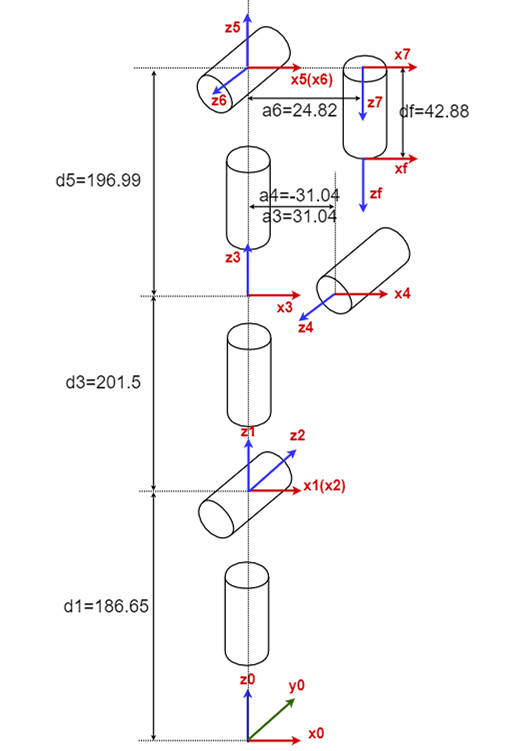

### 2.5.1 关节运动范围

| 关节       | 范围 |
| :--------: | :----------:|
| J1  | -178 ~ +178|
| J2  | -74  ~ +130|
| J3  | -178 ~ +178|
| J4  | -180 ~ +10 |
| J5  | -178 ~ +178|
| J6  | -20  ~ +273|
| J7  | -180 ~ +180|

### 2.5.2 DH参数
DH建模：

MDH参数表：

