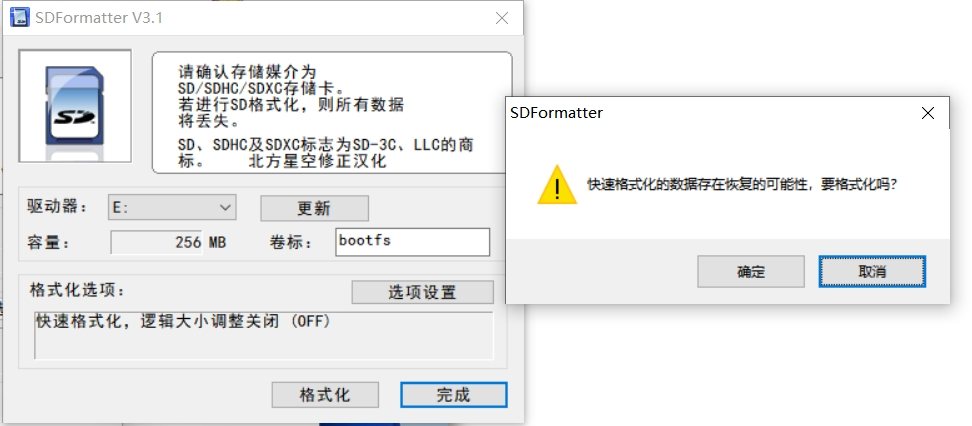

# System image

## Published system

| Version       | Information            | Download |
| ------------- | ---------------------- | -------- |
| v1.0.0.240510 | Initial version system | 123      |

## System image burning

### Windows burn

1. Select the system image you want to burn and download it. After downloading, unzip it.
2. Install [rpiboot](https://github.com/raspberrypi/usbboot/raw/master/win32/rpiboot_setup.exe) program。
   > Remember the installation path, as the program will not automatically generate desktop shortcuts after installation.
3. Using the `rpiboot` program to turn a CM4 device into a computer disk

   1. Mechanical arm shutdown
   2. Connect one end of a Type-C data cable that can communicate to a computer
   3. Press the button above the USB port on the base, **always keep it pressed**, and connect the other end of the type-c cable to the type-c port on the base.
      
      
   4. Turn on the power of the robotic arm and turn it on
   5. Open the installation folder of `rpiboot`, double-click with the left mouse button to execute `rpiboot.exe`
   6. Observe the computer side until CM4 becomes a computer disk, then release the button.

4. Use [official SDFormatter](https://www.waveshare.net/w/upload/d/d7/Panasonic_SDFormatter.zip) to format and clean the disk. Open the SDFormatter software, select the drive, click on option settings, set the logical size adjustment to the on state, click OK, and then proceed with the formatting operation. Unsuccessful, continue with the previous operation and reformat it.
   
   
5. Use the [Raspberry Pi Imager](https://www.raspberrypi.com/software/) burning tool to burn the decompressed system image.
   
   
   
6. After the burning is completed, the robotic arm can be restarted

### Linux burn

1. Select the system image you want to burn and download it. After downloading, unzip it.
2. Use the source code compilation rpiboot tool to compile the libUSB development library

   ```shell
    sudo apt install git libusb-1.0-0-dev pkg-config
    git clone --depth=1 https://github.com/raspberrypi/usbboot
    cd usbboot
    make
    # sudo ./rpiboot
   ```

3. Connect one end of a Type-C data cable that can communicate to a computer
4. Press the button above the USB port on the base, **always keep it pressed**, and connect the other end of the type-c cable to the type-c port on the base.
5. Execute the rpiboot program

   ```shell
    sudo ./rpiboot
   ```

6. Burning images can be done using the official burning software Raspberry Pi Imager, following the same steps as burning on Windows. You can also directly use the dd command to burn. The following burn command is for reference only. Please replace the disk object before using it.

   ```shell
    sudo dd if=./A1_ubuntu20.04_240325.img of=/dev/sdx bs=1M status=progress oflag=dsync
   ```

7. After the burning is completed, the robotic arm can be restarted
