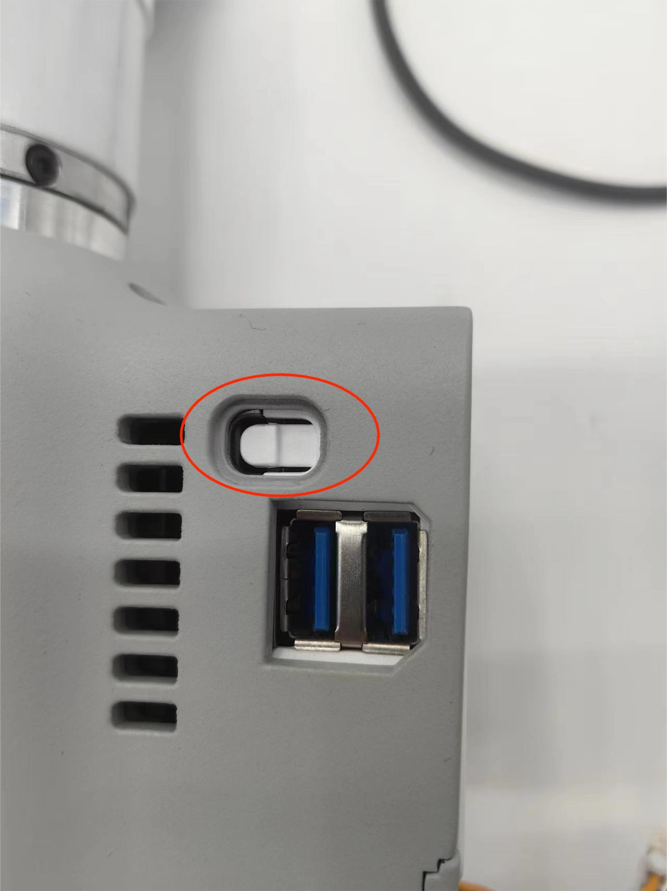
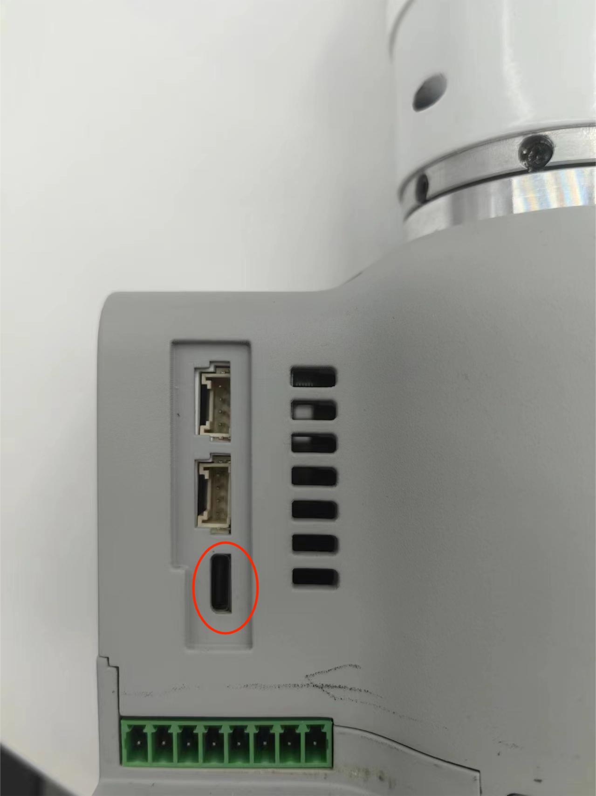
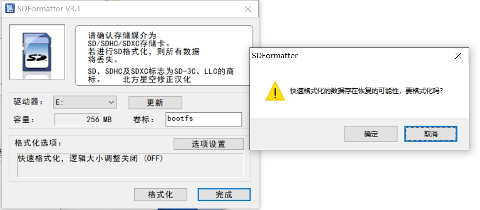
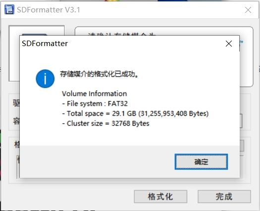
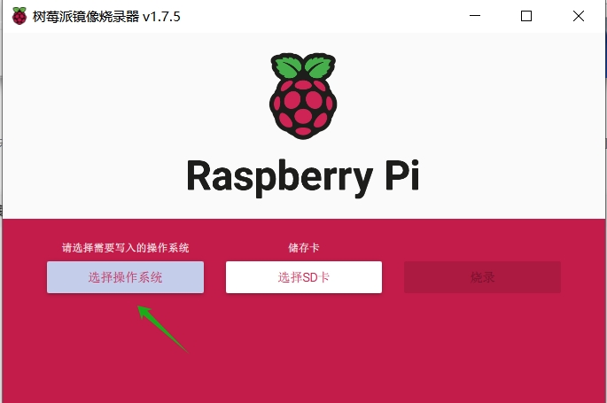
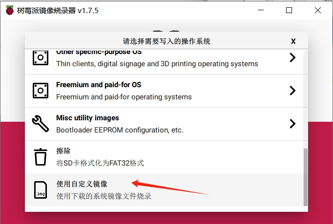
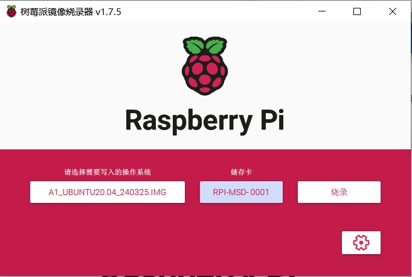

# 系统镜像

## 已发布系统

| 版本          | 信息 | 下载地址 |
| ------------- | ---- | -------- |
| v1.0.0.240511 | 初版 | 待补充   |

## 镜像烧录

### Windows 烧录

1. 选择你要烧录的系统镜像并且下载，下载之后解压。
2. 安装[rpiboot](https://github.com/raspberrypi/usbboot/raw/master/win32/rpiboot_setup.exe)程序。
   > 注意记住安装路径，程序安装以后不会自动生成桌面快捷方式。
3. 使用`rpiboot`程序将 CM4 设备变成一个电脑磁盘

   1. 机械臂关机
   2. 用一根可以通信的 type-c 数据线，一端连接电脑
   3. 按下底座 USB 接口上方的按钮，**始终保持按下状态**，并且将 type-c 线的另一端连接底座的 type-c 口。
      
      
   4. 打开机械臂电源通电
   5. 打开`rpiboot`的安装文件夹，鼠标左键双击执行`rpiboot.exe`
   6. 观察电脑端，直到 CM4 变成电脑磁盘，即可松开按钮。

4. 使用[官方 SDFormatter](https://www.waveshare.net/w/upload/d/d7/Panasonic_SDFormatter.zip)格式化清理磁盘。打开 SDFormatter 软件，选中驱动器，点击选项设置，将逻辑大小调整设置为开启状态，点击 OK ，然后进行格式化操作。 不成功，继续刚刚操作，重新格式化就可以了。
   
   
5. 使用[Raspberry Pi Imager](https://www.raspberrypi.com/software/)烧录工具，烧录解压好的系统镜像。
   
   
   
6. 烧录完成以后，机械臂重新开机即可

### Linux 烧录

1. 选择你要烧录的系统镜像并且下载，下载之后解压。
2. 使用源码编译 rpiboot 工具,来编译 libusb 开发库
   ```shell
    sudo apt install git libusb-1.0-0-dev pkg-config
    git clone --depth=1 https://github.com/raspberrypi/usbboot
    cd usbboot
    make
    # sudo ./rpiboot
   ```
3. 用一根可以通信的 type-c 数据线，一端连接电脑
4. 按下底座 USB 接口上方的按钮，**始终保持按下状态**，并且将 type-c 线的另一端连接底座的 type-c 口。
5. 执行 rpiboot 程序
   ```shell
    sudo ./rpiboot
   ```
6. 烧录镜像，可使用官方烧录软件 Raspberry Pi Imager 进行烧录，步骤和 windows 下烧录操作一样。 也可以直接使用 dd 命令进行烧录。下面烧录命令仅供参考，请替换磁盘对象后进行使用。
   ```shell
    sudo dd if=./A1_ubuntu20.04_240325.img of=/dev/sdx bs=1M status=progress oflag=dsync
   ```
7. 烧录完成以后，机械臂重新开机即可.
