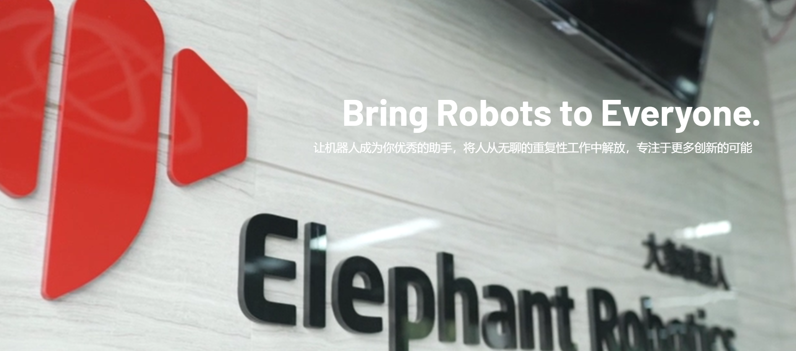

# 大象机器人

## 1 公司介绍

大象机器人总部位于中国深圳，是一家专注于机器人研发、设计和自动化解决方案的高科技企业。

公司致力于为机器人教育科研机构、商业场景、工业生产提供高灵活性的协作机器人、简单易学的操作系统和智能自动化解决方案。大象机器人已获得韩国、日本、美国、德国、意大利、希腊等国家多家世界500强企业工厂的一致认可和好评。

大象机器人秉承“畅享机器人世界”的愿景，倡导人与机器人的协同工作，旨在让机器人成为工作和生活中有价值的助手。公司致力于帮助人们从简单、重复、单调的工作中解放出来，利用人机协作的优势提升工作效率，创造美好新生活。

未来，大象机器人将以前沿科技推动机器人行业发展，共同开启自动化、智能化新时代。

## 2 发展历程

2016.08 -----大象机器人有限公司正式成立。

2016.08 -----入驻HAX孵化器，获得SOSV种子轮投资。

2016.08 -----开始研发大象S工业协作机器人。

2017.01 -----荣获“CES中国最具创新力企业十强”。

2017.04 -----参加汉诺威工业博览会、韩国自动化展。

2017.07 -----两位创始人入选福布斯亚洲“30位30岁以下商界精英”。

2017.10 -----推出第五代单臂工业协作机器人大象S。

2018.04 -----获得“云天使基金”天使轮投资。

2018.06 ----- 首次亮相2018汉诺威世界工业博览会。

2018.06 ----- 荣获长江商学院“智能制造创业MBA奖”。

2018.06 ----- 荣获清华经管学院“X-elerator奖”。

2018.11 ----- 荣获亚洲智能硬件大赛深圳赛区第二名。

2018.11 ----- 荣获金球奖“最具投资企业奖”。

2019.03 ----- 荣获金球奖“领导力奖”。

2019.04 ----- 2019年3月 Catbot 荣获“工业机器人创新奖”。

2019.09 -----参加华为欧洲生态系统大会（HCE），正式成为华为生态合作伙伴。

2019.11 -----大象机器人与哈尔滨工业大学共同出席IROS国际智能机器人与系统大会。

2019.12 -----大象机器人-华南理工大学“智能机器人联合开发实验室”正式揭牌。

2019.12 -----荣获高工2019年度“创新技术奖”。

2019.12 -----荣获高工2019年度“十大快速成长企业”。

2019.12 -----荣获深圳装备行业-工业机器人细分领域-“新锐企业奖”。

2019.12 -----推出全球首款仿生机器猫MarsCat。

2020.05-----创始人荣获2019年度深圳机器人新锐人物奖。

2020.10-----推出全球最轻最小六轴协作机器人myCobot。

2021.03-----推出最小科研协作机器人myCobotPro 320。

2021.05-----MarsCat获得新华财经、中国日报、南京日报、哈尔滨日报等媒体争相报道。

2021.07-----发布最小复合材料机器人底盘——小象移动机器人myAGV。

2021.09-----推出全球首款全包裹四轴机械臂——小象码垛机械臂myPalletizer。

2022.01-----获得36氯、极客公园关于大象机器人在轻消费机器人行业所扮演角色的系列报道。

2022.02 ----- MarsCat、myCobot亮相春晚视频直播，参与深圳卫视跨年特别节目。

2022.05 ----- 推出最紧凑小型六轴机械臂mechArm，可进行人工智能机器人教育。

2022.06 ----- 结合Unity引擎，基于myCobot机器人推出人工智能机器人实用入门书+书籍（国际课程）。

2022.07 ----- 发布人工智能时代的仿真陪伴机器猫metaCat。

2022.07 ----- 发布史上最小双臂协作机器人mybuddy。

2022.08 ----- 荣获“十大非工业技术创新奖”。

2022.08 ----- 创始人荣获“2022深圳机器人新锐人物奖”。

2022.11 ----- 科大讯飞AI开发者大赛实时互动赛道亚军。

2022.11 ----- 2022世界声学博览会1024科技博览会最佳机器人奖。

2022.12 ----- 央视报道。

## 3 相关链接

- 官网：[https://www.elephantrobotics.com](https://www.elephantrobotics.com)

- 购买链接：
- 淘宝：[https://shop504055678.taobao.com](https://shop504055678.taobao.com)
- Shopify：[https://shop.elephantrobotics.com/](https://shop.elephantrobotics.com/)

- 视频：
- Bilibili：[大象机器人个人空间-大象机器人个人主页-Bilibili视频](https://space.bilibili.com/2126215657)
- YouTube：[大象机器人-YouTube](https://www.youtube.com/c/Elephantrobotics)

- Facebook： [https://www.facebook.com/mycobotcreator/](https://www.facebook.com/mycobotcreator/)

- Linkedin：[https://www.linkedin.com/company/18319865](https://www.linkedin.com/company/18319865)

- Twitter：[https://twitter.com/CobotMy](https://twitter.com/CobotMy)

- Discord：[https://discord.gg/2MAherp7nt](https://discord.gg/2MAherp7nt)

- Hackster：[https://www.hackster.io/elephant-robotics](https://www.hackster.io/elephant-robotics)

[← 上一页](./9-AboutUs.md) | [下一页 →](./9.2-contact.md)