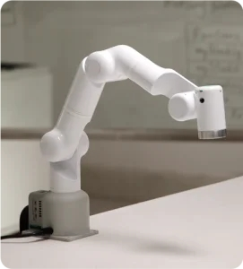

## Mercury A1_Gitbook

欢迎来到Elephant Robotics水星系列的世界——这里，创新与实用性交织，为具身智能和人形机器人研究提供了一个前所未有的通用硬件平台。我们自豪地呈现三个独特的产品型号，每个都以其卓越的特性，满足您在机器人研究和教育领域的多样化需求。

&emsp;&emsp;水星X1轮式人形机器人：整机共19自由度，它结合了高性能移动底座与先进的双臂协同和感知能力，搭载英伟达Jetson边缘计算核心，和3D机器视觉，为机器人学和具身智能研究和开发提供了强大算力和硬件基础。

&emsp;&emsp;水星B1半人形机器人，拥有17个自由度和双七轴机械臂，搭载英伟达Jetson边缘计算核心，3D机器视觉，和语音交互能力，是人机交互研究和双臂协同控制研究的首选。

&emsp;&emsp;水星A1七轴机械臂：教育者的理想选择，这款7自由度的轻量级谐波关节机械臂，有效载荷1kg，可触摸的快速控制界面和应用软件极大简化了应用部署，无需复杂编程。

水星系列，不仅是机器人技术的集大成者，更是推动科学探索和教育创新的伙伴。

 
水星Mercury A1 轻量级7自由度协作机器人

## 1 概况

 **Mercury A1** 拥有精致的结构和一体化设计，其最大臂展为450毫米，最大负载为1千克，重复定位精度为±0.05毫米。

Mercury A1重3.5千克，负载1千克，工作半径为450毫米。这款产品具有强大的功能，操作简便，能够安全地与人类协作。

## 2   特性

-   **操作简便且开源**
    -  用户可以在快速启动学习后，通过myBlockly和拖动式教学轻松操作机器人。
    -  它支持ROS和MoveIt等开发系统。
强大性能且配备两个屏幕
    
-   **Economical and cost-effective**
    -   It adopts a standardized 8-hour working system so as to replace human in doing repetitive and standard jobs.
    -   Worth over 10,000 RMB, it reduces costs and synergizes efforts for high-efficiency scientific research.
    
-   **Powerful performance and equipped with two screens**
    -   It adopts a brushless DC servo so as to realize repeated positioning precision of ±0.5mm.
    -   The body is equipped with two screens and supports M5 ecological applications, effectively expanding coordinative application.
    
-   **On-in-all design and safe collaborative work**
    -   With delicate structure, it optimizes space and integrates with application in a coordinated way.
    -   It also has kinematics self-interference detection, which can effectively avoid motion collisions.

## 3 应用

Mercury A1 不仅是生产工具，还是拓展想象力边界的工具。这意味着它可以与多种末端执行器配合使用，以适应各种应用，如科研、教育和功能展示等。用户体验极佳。

## 4 章节总结

本手册的下一部分将引导您进入子部分，让您更全面地了解我们的产品规格、控制核心参数、机械结构参数、电气特性参数和坐标系定义。

请根据您的兴趣和需求自由选择以下章节：

[2.1-Machine specification](2.1.1-MachineSpecification.md) 
 在这一部分中，我们将描述产品的基本属性，如机器人描述负载、扭矩、定位精度、尺寸、功能支持和功率参数等的行业共识。 

[2.2-Control core parameter](2.1.2-ControlCoreParameter.md) 
了解产品的主要控制参数，方便后期定制开发和使用。 

[2.3-Mechanical structure parameter](2.1.2-ControlCoreParameter.md) 
在这一部分中，我们将详细介绍产品机械结构的重要参数，并为客户提供相应的3D模型下载链接，以便客户更好地了解我们的产品 

[2.4-Electrical characteristic parameter](2.1.4-ElectricalCharacteristicParameter.md) 
本章将为客户提供产品的电气特性参数，方便客户在后期定制开发和使用。 

[2.5-Coordinate system](2.1.5-CoordinateSystem.md) 
本节描述了产品的角度和坐标信息，并解释了支持的坐标系控制。同时，为计算相应坐标系提供了产品的相关参数，如DH参数等。
请根据兴趣点击相应链接，以 

请根据兴趣点击相应链接，以获取更详细的信息。如果您有任何问题或需要进一步的帮助，请随时联系我们的客户支持团队。我们致力于为您提供支持和指导。感谢您选择我们的产品，我们期待为您提供卓越的用户体验！ 

## 5 致谢之辞 

非常感谢您花时间阅读Mercury A1用户手册。我们希望本文档能够帮助您更好地了解并有效使用这款机器人，从而激发您的创造力。 

----
如果您已经阅读完本章所有内容，请继续下一章。 

[← 上一页](../../2-ProductIntroduction/README.md)| [下一页 →](../../3-UserNotes\IssueFAQ/REMADE.md)

[章节导航](./SUMMARY.md)